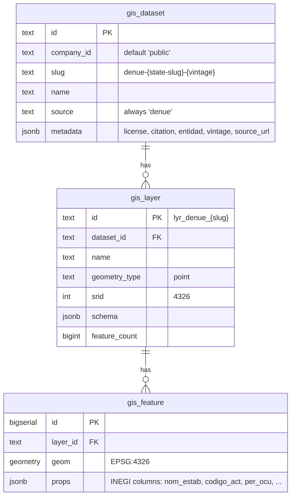
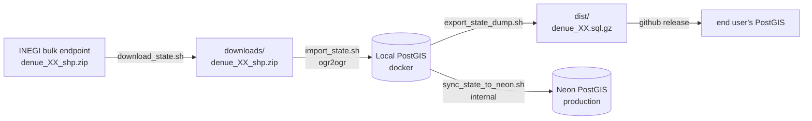

# docuget-gis-data

> Mexico DENUE (INEGI) as drop-in `.sql.gz` snapshots for PostGIS, plus the
> tooling to refresh them each year from INEGI's bulk-download endpoint.

The **Directorio Estadístico Nacional de Unidades Económicas (DENUE)** is
INEGI's open catalog of every economic unit in Mexico — roughly **5 million
points**, refreshed twice a year, covering all 32 entities (states). Each
point carries 50+ attributes: name, activity code (SCIAN), address, employee
band, contact, coordinates.

This repository gives you two things:

1. **Pre-built `.sql.gz` snapshots** hosted on CDN — one per state, plus a
   national rollup. Each snapshot includes the schema bootstrap, so any
   empty PostGIS database becomes a working DENUE database in seconds:

   ```bash
   # Download a single state (or use: all | mx | full)
   ./scripts/download.sh 24

   # Restore into any PostGIS database
   createdb mexico
   psql -d mexico -c "CREATE EXTENSION postgis;"
   gunzip -c dist/denue_24.sql.gz | psql -d mexico
   # ✓ Restored DENUE San Luis Potosí (2025) — layer lyr_denue_slp
   ```

2. **A reproducible pipeline** that re-builds those snapshots from INEGI's
   canonical source. Re-run on every INEGI vintage release (usually May and
   November) and the snapshots refresh end-to-end.

## What's inside

| Path | Purpose |
|------|---------|
| `catalog/states.json` | The 32 INEGI entities (code, name, slug), source URL pattern, license metadata. **Single source of truth.** |
| `scripts/lib.sh` | Shared helpers — catalog lookup, env defaults, logging primitives. |
| `scripts/download_state.sh` | Pull one state's SHP zip from INEGI (ETag-aware, idempotent). |
| `scripts/import_state.sh` | Load one state's SHP into a local PostGIS container via `ogr2ogr`. Idempotent re-load. |
| `scripts/export_state_dump.sh` | Serialize one state's layer to a portable `denue_XX.sql.gz`. |
| `scripts/sync_state_to_neon.sh` | (Docuget-internal) promote a state's layer from local Docker → Neon. |
| `scripts/batch_local.sh` | End-to-end loop: download + import + dump, with state-by-state checkpointing. |
| `scripts/download_all.sh` / `import_all.sh` / `export_all.sh` | Wrappers around the per-state scripts for batch runs. |
| `scripts/download.sh` | Download pre-built snapshots from CDN into `dist/` (no restore). |
| `scripts/quickstart.sh` | Download + restore snapshots into a local PostGIS in one step. |
| `scripts/03_search_indexes.sql` | GIN trigram indexes for business name + city/municipality search (apply after data load). |
| `docker/docker-compose.yml` | Optional PostGIS 18 + 3.6 container if you don't already have one. |
| `docs/yearly-refresh.md` | Step-by-step procedure for refreshing the snapshots when INEGI publishes a new vintage. |
| `CITATION.md` | INEGI's required citation string + license link. **Read before redistributing.** |
| `LICENSE` | Apache 2.0 for the **scripts and catalog**. DENUE data itself is governed by INEGI's *Términos de Libre Uso*. |

## Quickstart (consume pre-built snapshots)

You need: any PostgreSQL 12+ with PostGIS 3.x.

```bash
# 1. Clone the repo (lightweight — no data files in git).
git clone https://github.com/quad-tree/docuget-gis-data.git
cd docuget-gis-data

# 2. Download the snapshot you want from CDN.
./scripts/download.sh 24              # one state (~5 MB)
./scripts/download.sh mx              # national rollup (~750 MB)
./scripts/download.sh full            # all 32 states + rollup (~1.5 GB)

# 3. Restore into an empty database with PostGIS installed.
createdb mexico
psql -d mexico -c "CREATE EXTENSION postgis;"
gunzip -c dist/denue_24.sql.gz | psql -d mexico

# 4. Use it.
psql -d mexico <<'SQL'
  SELECT count(*) FROM gis.gis_feature WHERE layer_id = 'lyr_denue_slp';
  SELECT props->>'nom_estab', ST_AsText(geom)
    FROM gis.gis_feature
   WHERE layer_id = 'lyr_denue_slp'
     AND props->>'nombre_act' ILIKE '%farmacia%'
   LIMIT 5;
SQL
```

Or use the all-in-one helper (downloads + restores in one step):

```bash
./scripts/quickstart.sh 24            # download + restore state 24
./scripts/quickstart.sh all           # download + restore all 32 states
./scripts/quickstart.sh mx            # download + restore the national rollup
```

## Build from source (refresh the snapshots)

You need: Docker, `jq`, `curl`, `unzip`, ~5 GB free disk.

```bash
# 1. Bring up a PostGIS loader container.
cd docker && docker compose up -d && cd ..

# 2. Set DB_PASSWORD (or copy docker/.env.example to docker/.env).
export GIS_DB_PASSWORD=devpass

# 3. Run the end-to-end batch (download + import + dump for all 32 states).
./scripts/batch_local.sh

# 4. Artifacts land in dist/. Verify a state restores into a fresh DB.
./scripts/quickstart.sh 24
```

Full procedure for yearly INEGI vintage refresh: see [`docs/yearly-refresh.md`](docs/yearly-refresh.md).

## Schema

Each snapshot creates three tables under the `gis` schema:



A GIST index on `gis_feature.geom` makes `ST_Intersects`, `ST_DWithin`, and
bbox queries fast. The layer's full extent is denormalized in
`gis_layer.feature_count`.

## Pipeline at a glance



## Why hand-rolled `.sql.gz` instead of `pg_dump`?

`pg_dump --data-only` output is brittle across PG major versions, assumes a
specific role/owner exists on the destination, and leaks
`set_config('search_path','',false)` into the pooled session (which can
break unrelated transactions on shared backends — we hit this in the
Docuget GIS migration). The hand-rolled form here:

- Creates the `gis` schema + tables with `CREATE … IF NOT EXISTS`, so the
  same snapshot applies to an empty DB and to one that already holds other
  states.
- Stages features through a `TEMP TABLE` so the COPY column types are
  decoupled from the destination's geometry types — works whether the
  destination has the same PostGIS minor version or not.
- Drops a single fixed `layer_id` before reloading, so re-applying a
  snapshot is idempotent (perfect for yearly refresh).
- Runs `VACUUM ANALYZE` after `COMMIT` — without this, the planner won't
  pick the GIST index on a fresh load, and `ST_*` queries do Seq Scan.

## Licensing

The **scripts and catalog** in this repo are **Apache 2.0** (see `LICENSE`).

The **DENUE data itself** is published by INEGI under the
*[Términos de Libre Uso de la Información](https://www.inegi.org.mx/inegi/terminos.html)*.
Redistribution is permitted with **attribution** — see [`CITATION.md`](CITATION.md)
for the required citation string. Every snapshot embeds the license + citation
in `gis.gis_dataset.metadata`.

## Refresh cadence

INEGI publishes new DENUE vintages roughly twice a year (typically May and
November). To refresh:

1. Bump `source.vintage` in `catalog/states.json`.
2. `./scripts/batch_local.sh` — re-runs the pipeline end-to-end.
3. `git tag v2025.11 && git push --tags` — creates a new GitHub release.
4. GitHub Actions (TODO: not yet wired) uploads the new `denue_*.sql.gz` to
   the release assets.

See [`docs/yearly-refresh.md`](docs/yearly-refresh.md) for the full procedure.

## Companion projects

- **api-gis** (Docuget) — Hono + PostGIS REST API consuming the same `gis` schema.
- **front-deno `/gis`** (Docuget) — OpenLayers viewer with bbox queries.
- Both are private to Docuget today; we'll open-source them after the
  schema stabilizes.
