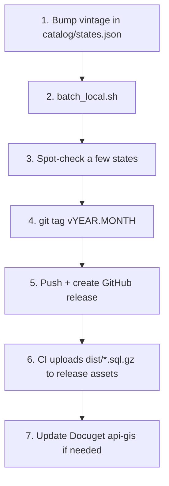

# Yearly refresh procedure

INEGI publishes new DENUE vintages roughly **twice a year** (typically May
and November). This procedure rebuilds every state snapshot from the new
source and ships a new GitHub release.

## When to refresh

- **Check Last-Modified headers** on `https://www.inegi.org.mx/contenidos/masiva/denue/denue_01_shp.zip`
  (any state will do — INEGI publishes the whole catalog at once).
- If the date is newer than what's recorded in `catalog/states.json →
  source.verified_at`, there's a new vintage.

A 30-second cadence check:

```bash
curl -sI https://www.inegi.org.mx/contenidos/masiva/denue/denue_24_shp.zip \
  | grep -i last-modified
```

## Refresh procedure



### 1. Bump the vintage in the catalog

```bash
# Example: refresh to the November 2025 vintage
$EDITOR catalog/states.json
# Change source.vintage from "2025-05" → "2025-11" (or whatever INEGI's tag is)
# Change source.verified_at to today's ISO date
```

The vintage threads through dataset IDs (`ds_denue_{slug}_{vintage}`) and
dump filenames? — **no**, dump filenames stay `denue_XX.sql.gz` (no vintage
in the name) so the GitHub-release "latest" URL keeps working. The vintage
is captured in:
- `gis.gis_dataset.metadata.vintage`
- The dump's header comment
- The GitHub release tag

### 2. Rebuild every snapshot

```bash
cd docker && docker compose up -d && cd ..    # if not already running
./scripts/batch_local.sh                       # ~1.5-2h unattended
```

The batch is state-by-state checkpointed. If it dies mid-run, re-run — it
skips states that are already loaded (use `FORCE_REIMPORT=1` to override).

### 3. Spot-check a few states

```bash
# State counts — should be similar to the prior vintage (DENUE grows ~1-2%/yr)
docker exec docuget-gis-db psql -U docuget -d docuget_gis -c "
  SELECT id, feature_count FROM gis.gis_layer ORDER BY id;
"

# Restore one dump into a fresh DB to validate the artifact is good
./scripts/quickstart.sh 24   # or any state
```

### 3.5. Rebuild the search layer

The synonym/gazetteer tables (`02_search_setup.sql`) are static and only need
re-applying if you changed them. But the **municipality dictionary**
(`05_gaz_municipio.sql`) and the **search indexes** (`03_search_indexes.sql`)
are derived from `gis_feature` — a new vintage adds/moves municipios, so they
go stale. Rebuild them on every reloaded database (local and Neon):

```bash
PGURL="$GIS_DATABASE_URL" ./scripts/quickstart.sh search
# re-applies 02 → 03 → 05; 05 (gaz_municipio) is the one that MUST be rebuilt
```

Skipping the `05` rebuild leaves city-name search resolving against the old
municipality centroids/counts (and missing any new municipios).

### 4. Tag the release

```bash
# Use INEGI's vintage as the tag — e.g. v2025.11 for the November 2025 vintage.
git tag v2025.11
git push origin v2025.11
```

### 5. CI uploads release assets

A GitHub Action (TODO: not yet wired) triggers on tag push and uploads
every `dist/denue_*.sql.gz` to the release matching the tag. Until that
ships, upload manually with `gh release upload`:

```bash
gh release create v2025.11 \
  --title "DENUE 2025 (November vintage)" \
  --notes "INEGI DENUE refresh — November 2025 vintage. See CITATION.md." \
  dist/denue_*.sql.gz
```

### 6. Update Docuget api-gis (if relevant)

If any state's `lyr_denue_*` layer is referenced by hard-coded id in
api-gis routes, re-run the Neon sync to refresh the production reader:

```bash
cd /home/docuget/docuget_api    # any repo with GIS_DATABASE_URL in .env.schema
for code in $(jq -r '.states[].code' /home/docuget/docuget-gis-data/catalog/states.json); do
  varlock run -- /home/docuget/docuget-gis-data/scripts/sync_state_to_neon.sh "$code"
done
```

This step is **Docuget-internal** and not part of the public refresh.

## What can go wrong

| Symptom | Likely cause | Fix |
|---|---|---|
| `ogr2ogr` warns "Value … exceeds 18,17 precision" | INEGI declared `numeric(18,17)` on lat/lng, but some values exceed it. | The importer already passes `-lco PRECISION=NO` — if you see this, check that flag is still in `import_state.sh`. |
| Loader hangs on COPY | `docker exec ... psql <<SQL` without `-i` silently discards stdin. | All scripts in this repo use `-i` — but if you write a one-off, watch out. |
| Restore says "could not open extension control file ... postgis.control" | PostGIS not installed on the destination. | `CREATE EXTENSION postgis;` before restoring. |
| Restore fails with "permission denied for schema gis" | Destination role lacks CREATE on the database. | Either use a superuser-equivalent role, or pre-create the `gis` schema and grant it to the role. |
| Restore succeeds but `ST_*` queries do Seq Scan | Planner hasn't analyzed since the bulk load. | The dump includes `VACUUM ANALYZE` at the end, but if you bypassed that, run it manually. |
| Bbox queries on the GIS table return nothing | GIST index wasn't picked. | Same — `VACUUM ANALYZE gis.gis_feature;`. |
| INEGI bulk URL returns 404 | INEGI moved the file. | Check `https://www.inegi.org.mx/app/descarga/?ti=6` for the new URL pattern; update `catalog/states.json → source.url_pattern_shp`. |

## License audit before pushing

DENUE is freely redistributable under INEGI *Términos de Libre Uso* —
**with attribution**. Every snapshot already embeds the citation in
`gis.gis_dataset.metadata.citation`. Sanity check:

```bash
gunzip -c dist/denue_24.sql.gz | head -20 | grep -i 'INEGI'
# Should show the citation block in the dump header.
```

If the citation block is missing or wrong, **don't push** — fix
`export_state_dump.sh` first.
